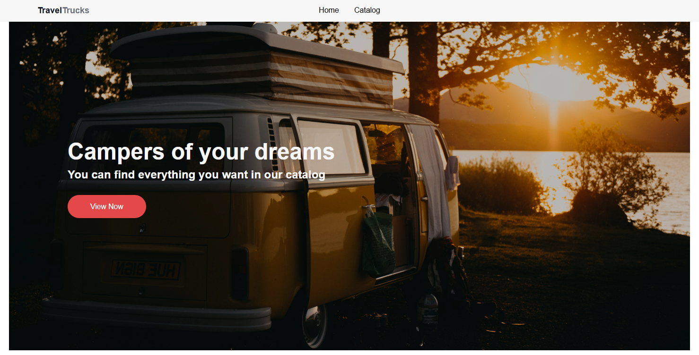
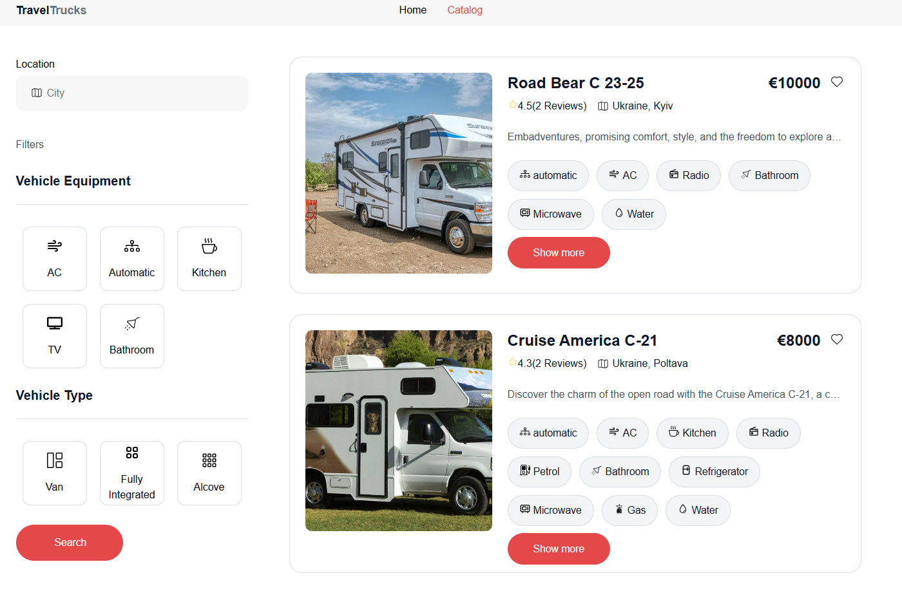
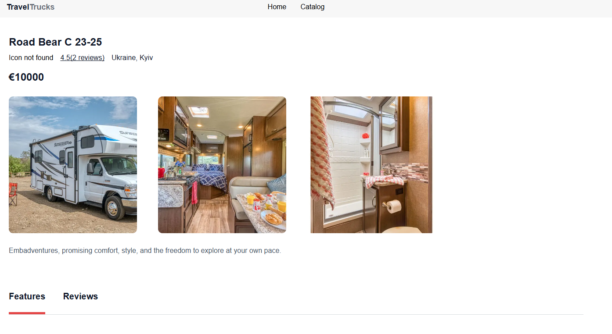
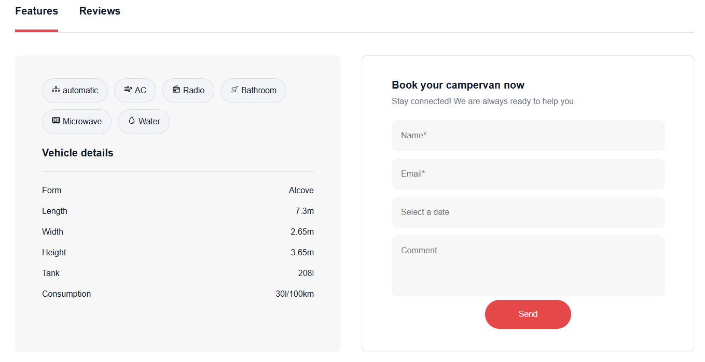
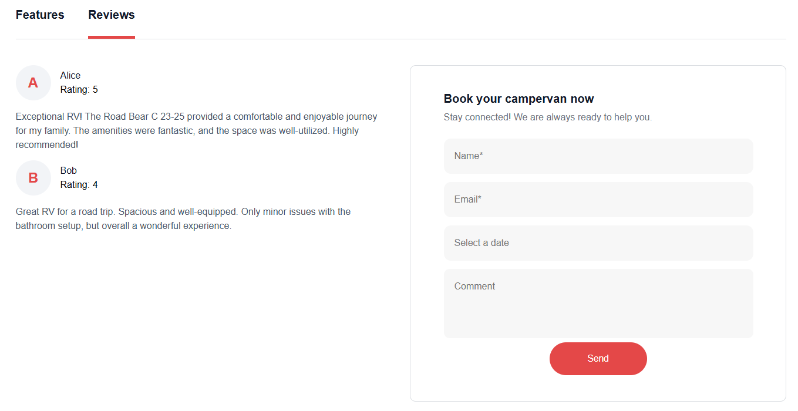

<h1 align="center">Travel Trucks</h1>
# React + Vite

This template provides a minimal setup to get React working in Vite with HMR and
some ESLint rules.

Currently, two official plugins are available:

- [@vitejs/plugin-react](https://github.com/vitejs/vite-plugin-react/blob/main/packages/plugin-react/README.md)
  uses [Babel](https://babeljs.io/) for Fast Refresh
- [@vitejs/plugin-react-swc](https://github.com/vitejs/vite-plugin-react-swc)
  uses [SWC](https://swc.rs/) for Fast Refresh

### 👀 Preview of Pages

  

*HomePage: Welcome to Travel Truck*

  

*CatalogPage: Choose your camper*

  

*DetailsPage: See more details about camper*

  

*FeaturesPage: See camper features and book yours*

  

*ReviewsPage: See camper reviews and book yours*

